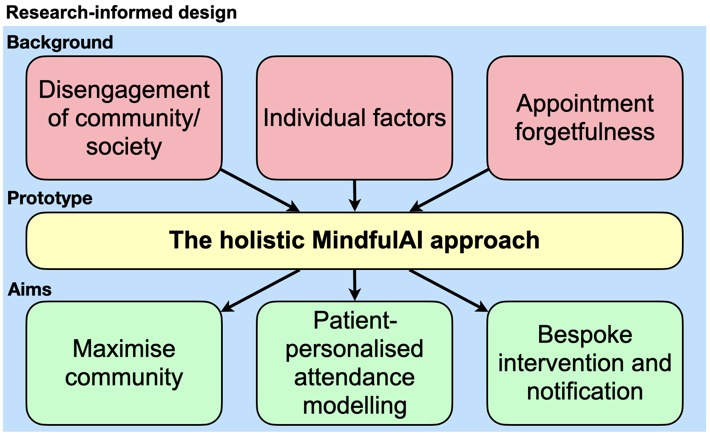
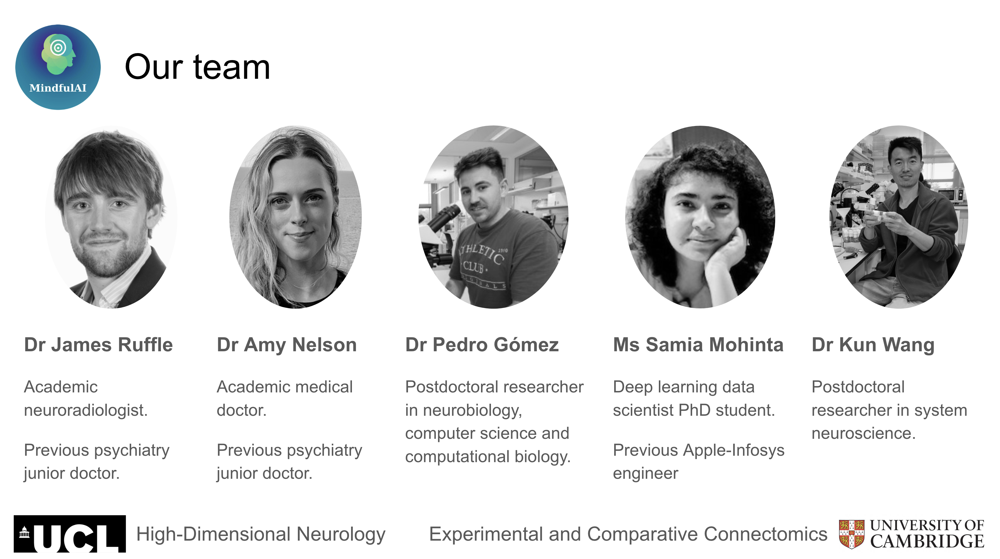

# MindfulAI
## Maximising patient engagement, fostering community & enabling patient-provider communication.


## Table of Contents
- [What is this repository for?](#what-is-this-repository-for)
	- [The problem](#the-problem)
	- [Our solution](#our-solution)
- [Code](#code)
	- [Quickstart](#quickstart)
	- [Patient mobile application](#patient-mobile-application)
	- [Researcher dashboard](#researcher-dashboard)
	- [Simulated data pipeline](#simulated-data-pipeline)
	- [Visual insights](#visual-insights)
	- [Machine learning prediction of non-attendance](#machine-learning-prediction-of-non-attendance)
- [MindfulAI team](#mindfulai-team)
- [Usage queries](#usage-queries)
- [License](#license)


## What is this repository for?
Welcome to the [MindfulAI team](#mindfulai-team) codebase for the [2023 Wellcome Data Science Ideathon](https://wellcome.org/grant-funding/schemes/ideathon) *Mental Health Challenge: Develop a platform for long-term participant retention.*

### The problem
**1 in 7** people suffer with a mental health disorder. However, patient retention is a major limitation to long-term follow-up in both clinical care and the research of mental health, **rendering it difficult to innovate in**. The cause is for **multiple reasons**, not only the patient level, but also that of their researcher and healthcare providers. 

**Having spoken to patients suffering from mental health disorders, and psychiatry doctors to ascertain reasons for non-attendance in both clinical care and research**, the following key themes transpire:
1) **Many of these disorders cause disengagement from society and community**. 
2) With long delays between original referral and appointment, **appointments are forgotten about**. 
3) **Mental illness is heterogeneous**, varying greatly across individuals.

Patient non-attendance **affects all stakeholders**: 
- 1) the **patient**, whose health and healthcare is affected;
- 2) the **healthcare providers**, whose ability to improve outcomes is reduced;
- 3) **researchers**, whose ability to study treatments is hampered.

**This is a problem that no single intervention at patient, researcher, or clinician-facing levels could conceivably block.** Nor will one intervention succeed for all: **there is no ‘silver bullet’ to ensure patient retention.**

*Our proposal embraces this directly*. We firmly believe that interventions that maximise patient engagement, ensure follow-up and treatment **must be not only multifaceted but closely personalised, if they are to be effective.**


### Our solution
We propose an end-to-end software solution **designed both for patients, on one interface, and researchers and healthcare providers, on another.**



Our system is designed to achieve two main deliverables: 
1) A **patient mobile application** designed to continuously **maximise engagement, facilitate communication between patient and researcher/healthcare providers, enabling support offered by a 24/7 AI advisor (chatbot)**, and stimulate a **unique sense of community** typically absent in not only mental health care, but also in research trials, all achievable in an *anonymised data-protected setting*. 
2) A **researcher dashboard** providing valuable cohort and individualised data-insights, **powered by machine-learning to predict non attendance at the individual patient level** in *real-time*. This predictive capability is achieved by combining information collected from the patient mobile application and in-person trial data.  Additionally, the dashboard provides **notification attendance interventions** for both patients and researchers.

### Design
Our researcher dashboard and a patient mobile application follows Model-View-Controller (MVC) software design framework:


- The **Model** represents the data and the business logic of the application. It encapsulates the data and provides methods to manipulate and access it. The Model component is responsible for managing the application's state and performing operations on the data.

- The **View** is responsible for presenting the data to the user. The View receives data from the Model and displays it in a way that is understandable and interactive for the user.

- The **Controller** acts as an intermediary between the Model and the View. It handles user input, processes requests, and updates the Model or View accordingly. The Controller interprets user actions and triggers the appropriate operations in the Model or View. It helps maintain the separation of concerns between the data manipulation and the user interface.

## Code
### Quickstart
You can start using our prototype, *with only [python](https://www.python.org/) required*, in **just two simple steps**:

1) **Using the terminal**
```
git clone https://github.com/WellcomeIdeathon2023/MindfulAI
python -m http.server
```

2) In your **web browser**, navigate to the URL returned by the above command ```python -m http.server``` (this is usually ```http://[::]:8000/```)
- To use the **Patient mobile application**, in your browser navigate to [/code/retention-wireframe](/code/retention-wireframe/index.html)
- To use the **Researcher dashboard**, in your browser navigate to [/code/researcher-dashboard](/code/researcher-dashboard/index.html)


*More detail on the software constituents are given below.*

### Patient mobile application
We have equipped the [patient mobile application](/code/retention-wireframe) with **6 core functionalities** linked to the dashboard in addition to a system of push notifications, as follows:

1) An **intuitive and accessible** appointment booking system that *takes into account patient and provider availability*. This feature allows patients to conveniently schedule both in-person and online appointments, offering *flexibility* that adapts to their work or daily routines. The appointments will be seamlessly synchronised with the calendars of both patients and clinicians. 
   
2) A comprehensive **appointment reminder notification system**. This not only reminds patients of their upcoming appointments but also captures potential non-attendance risk factors that are beyond the patient's control. For instance, it can alert users about transportation disruptions by interfacing with open source transit and weather information.

3) A **gamification approach to maximise engagement** leveraged from a prize hub system, promoting the *use of the application*, *attendance*, *symptom recording*, and *community involvement*. By incorporating reward-like elements, **our aim is to make the patient lived experience of clinical trials more enjoyable to encourage continued engagement**.

4) A **journal** and **AI-powered chatbot** as support with **guidance and patient signposting**. The journal allows patients to track their symptoms and mood, providing *tailored information* that contributes to their overall well-being. The chatbot serves as a helpful resource with *instant support and guidance*. Collected information is fed back to the researcher's dashboard for **analytics in predicting retention** and **alerts to reduction in patient well-being**. We ensure **strict data protection** measures while collecting and analysing feedback from trials and other patient-application interactions. This allows us to gain valuable insights into patient engagement, and **forecast retention**, while improving the overall user health and experience.
   
5) **A contact portal with researchers and healthcare providers** in emergency situations, enabling messaging directly to the specialist via a text communication interface. **From our patient-led research, many report this as a problem that needs a solution**. We also have NGO (support lines) information built in as additional resources, for instances such as during out of NHS hours care.

6) **Community engagement**. Sense of community is often lost in mental illness, yet group activity forms an important part of patient therapy. We take this on board directly, incorporating **a supportive community recommendation system**.


### Researcher dashboard
Our [researcher dashboard](/code/researcher-dashboard) is specifically **designed to support healthcare providers and researchers**. This dashboard is equipped with a wide range of functionalities to maximise retention rates in clinical trials. By providing both **valuable cohort and patient-specific data insights**, it enables them to personalise care and interventions, ultimately enhancing participant retention in the long term. The researcher dashboard has **3 core functionalities**, as follows:

1) **Participant engagement tracking with real-time analytics**. This includes *geospatial analysis* to facilitate location-based insights and decision-making. For instance, consider a multi-centre trial where patient dropout was high at a specific centre, this would be immediately apparent though our framework.

2) **Predictive retention**, incorporating *machine learning predictions identifying those at risk of study dropout*.

3) **Calendar informatics**, with appointment management tools to enable more personalised patient-provider scheduling, with in-built reminders and notifications.


### Simulated data pipeline
Our [simulated data pipeline](/code/simulated_data/simulate_data.ipynb) is configurable for **any number of patients**, **any number of measurement timepoints**, and **any number of staff members**, modifiable dependent on the size of the mental health trial being simulated. 

- **For patients**, this generates an array of data including demographic, social history, medical and drug history, geostatistical, accompanying simulated general practitioner and named psychiatrist contact and address details, and simulated patient engagement levels across all aspects of the mobile application prototype. Also simulated are different levels of patient awards, or 'badges' for varying levels of patient engagement. 
- **For researchers**, this generates staff information with different roles across different study sites, with synthetic contact details to facilitate the patient-provider communication stream.

*Please note that all data is entirely synthetic, but is implicitly designed to be closely remnant of NHS / study trial data, guided by our experience in this domain.* 
[Software requirements](/code/simulated_data/requirements.txt).


### Visual insights
We provide a set of data-insight visualisations **designed in mind of the individual patient, and the researcher/healthcare provider.**

- [Encouraging Engagement](/code/dashboard_visualisations/engagement_figures.ipynb): a pipeline generating various patient gamified engagement data, including in relation to other *anonymised* trial participants/patients. For example, see the temporal polarplot [here](/code/dashboard_visualisations/engagement_temporal_polarplot.html).

- [Maximising Community](/code/graph/generate_graph.ipynb): A fully interactive network depicting all **anonymised** patients in the study, and the links between individuals, shown here by similarity across the various gamification point systems (appointment attendance, symptom logging, community forum engagement, app usage). The larger node depicts the current user and places them at the centre of this network to reinforce the notion of community. Pressing any of the user nodes will show their username, engagement points, user icon, and a set of badge awards they have won. For example, see the interactive graph object [here](/code/graph/participant_graph_d3_js.html). This can be readily configured to focus more on patient gamified points (to be patient-facing), or depict similarities across medical or attendance information (to be researcher-facing).

- [Symptom Logging](/code/dashboard_visualisations/engagement_figures.ipynb): which generates **interactive symptom logging**. For example, see the temporal line plot of a patient subjectively reporting their personal health rating (between 0-100) [here](/code/dashboard_visualisations/temporal_personal_health.html).

- [Geostatistic](/code/dashboard_visualisations/geostatistic.ipynb): a pipeline able to demonstrate patient data with respect to latitude and longitude data. Here we show [patient referral distribution](/code/dashboard_visualisations/map_outdoors.html) as a mere example, but this pipeline is easily modifiable to illustrate any or all of patient engagement, symptom logging, demographical, disease severity, or medicinal information.

Software requirements: i) [Engagement/Symptom/Geostatistics Analysis](/code/dashboard_visualisations/requirements.txt), ii) [Network Analysis](/code/graph/requirements.txt)


### Machine learning prediction of non-attendance
We provide a comprehensive **machine learning** attendance and study retention prediction system. This software driven approach is enabled by our prior work in predicting hospital appointment non-attendance, published in Nature Digital Medicine [here](https://doi.org/10.1038/s41746-019-0103-3), and reported by The Guardian newspaper [here](https://www.theguardian.com/society/2019/apr/12/hospital-develops-ai-to-identify-patients-likely-to-skip-appointments).

This [codebase](/code/dna_prediction/) includes a pipeline of:
- Data pre-processing
- Model training with gridsearching for hyperparameter optimisation
- Plot diagnostics, including cross-validated receiver operator characteristics.
- Directional feature importances to help delineate the **determinants of patient non-attendance** with [SHAPley Additive exPlanations (SHAP)](https://shap.readthedocs.io/en/latest/#).
- **Multi-site deployment functionality**, designed to **maximise model validity and generalisability**.
- [Software requirements](/code/dna_prediction/requirements.txt)


## MindfulAI team

Our clinician-developer multidisciplinary team comprise: [Dr James Ruffle](https://scholar.google.co.uk/citations?user=CVvowJAAAAAJ&hl=en), [Dr Amy Nelson](https://scholar.google.co.uk/citations?user=x3V1bvUAAAAJ&hl=en), [Dr Pedro Gómez Gálvez](https://scholar.google.es/citations?user=aWeyQGUAAAAJ), [Ms Samia Mohinta](https://scholar.google.uk/citations?hl=es&user=8RK7cxcAAAAJ), and [Dr Kun Wang](https://www.lucy.cam.ac.uk/postdocs/kun-wang).

## Usage queries
Via [GitHub issues](/issues).


## License
The code in this repository is licensed under a permissive [MIT License](LICENSE). All other content is licensed under CC BY 4.0. This means you may use any content in this repository as long as you credit the authors.


## Important documents

[Grant proposal](https://docs.google.com/document/d/18E0vn_kKEWm8t4av2vMKESG4D0ppOxcIYnY62cdOeFE/edit?usp=sharing)

[Pitch deck](https://docs.google.com/presentation/d/1CfRLndU0Jgr2K3OHDAomAgBhrk93uH9bfD9Q-Wuf83s/edit?usp=sharing)

[Team mood board](https://docs.google.com/presentation/d/1QeQwv7xchPC9CiCrI4cnN13w6T46su0TpLHLzxJ75lU/edit?usp=sharing)

[Challenge description](https://github.com/WellcomeIdeathon2023/mental_health_challenges/tree/main/)

[Initial application](https://docs.google.com/document/d/15vktVy9w2qgCcLNUS0TAojxYv0jEVSjZcaHxPAzbCDM/edit?usp=sharing)


This is your private repository for working on the challenges in the Wellcome Data Science Ideathon. This repository is maintained and monitored by Wellcome staff and will be made public after July 13 2023. Feel free to create additional folders in this repository but please use the existing ones as follows:

data - Any data that is loaded from your scripts (excluding data scraped/downloaded from the web) should be uploaded to this folder. Simulated data should be reproducible.
code - All code used as part of your solution should be uploaded this folder and is expected to be reproducible.
results - Final results, including presented slides and other content, should be uploaded to this folder.
